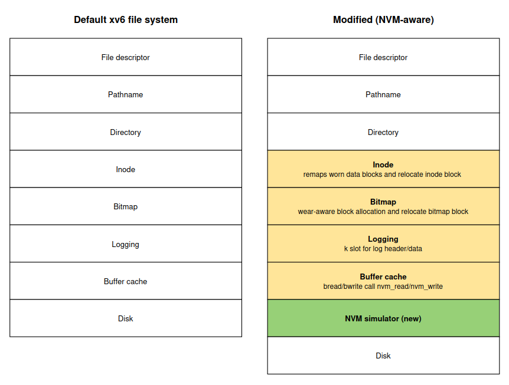
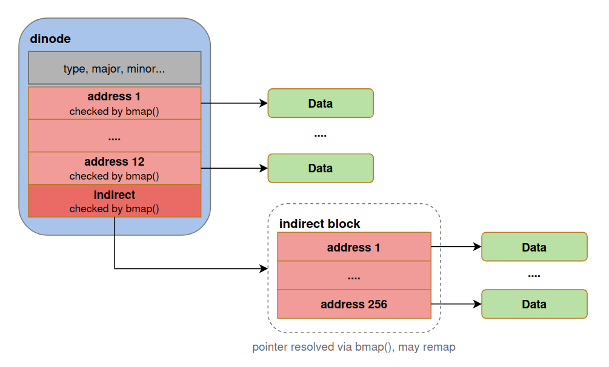
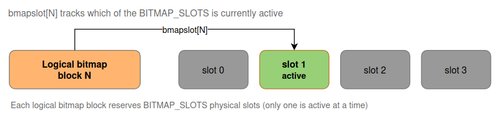
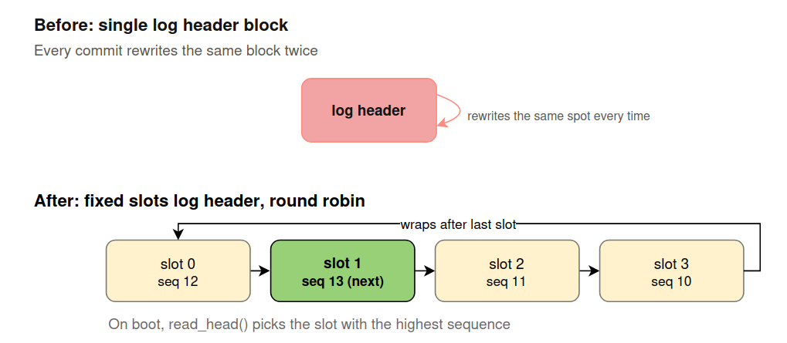
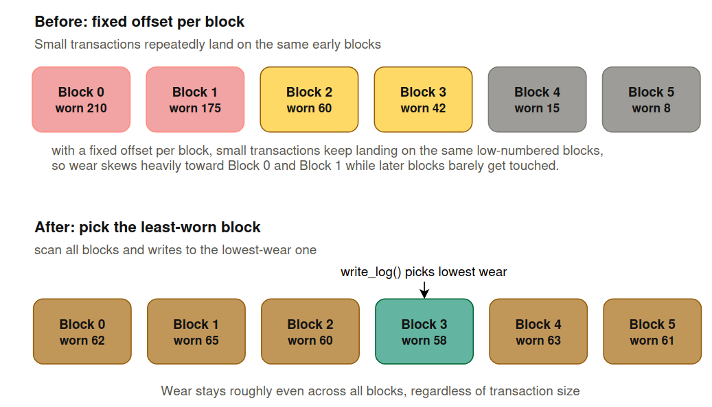

## Design Overview

xv6's normal file system treats every disk block the same. For NVM-aware file system, each block can only survive a limited number of writes before wearing out. This project adds a layer that **tracks wear and moves data around to keep writes spread evenly**, instead of hammering the same blocks.

- ### Inode layer
    - #### Remapping
    Adding the remapping pointer when `bmap()` want to resolve direct/indirect block address and find the least worn or exceed the wear skew limit (`NVM_WEAR_SKEW_LIMIT`), it allocates a fresh block (or least wear block) and remaps the pointer to it.
        

    The dinode's has the same layout as the standard xv6. What's different is behavior, the 12 direct addresses, the indirect pointer, and even the 256 individual entries inside the indirect block, now gets routed through `bmap()` wear check on every access, so any of them can silently redirect to a fresher block if the current one is worn or skewed.

    - #### Inode metadata block relocation
    The remapping above only moves the **data blocks** an inode points to. The physical block that stores the dinode structs themselves is also a write hot spot (every `iupdate()` touches it), so it gets rotating-slot treatment as well. 

    After an inode block is written, it checks whether the active slot is worn out or skewed. If so, relocate copies the entire inode block to the least-worn free slot.

- ### Bitmap layer
The free-block bitmap is also a write hot spot, since every `balloc`/`bfree` flips a bit, so it gets the same rotating-slot treatment as inode blocks. Each logical bitmap block reserves `BITMAP_SLOTS` physical slots on disk, and the superblock's `bmapslot[]` array tracks which physical slot is currently active for each logical block.

After allocated the least-worn free block and marks its bit, checks whether the active slot for that logical bitmap block is worn out or exceed wear skew. If so, relocate the bitmap block contents to the least-worn free slot.

- ### Logging layer
    - #### log header
        For the log header, it will stored across fixed size k slot that rotate round-robin on every write, each tagged with a monotonically increasing sequence. On boot, the `read_head()` scans all slots and loads the one with the highest seq (most recently committed header).
        
        **NOTE**: Round-robin is sufficient here because every commit writes the header exactly twice at a fixed size, so wear spreads evenly across the slots without needing to track per-slot wear.

    - #### log data
        For the log data, it will stored in the log data region, but instead of writing each block to a fixed offset, write_log() picks the least-worn unused slot for each block, this because transaction sizes vary, so a fixed rotation still skews wear toward low-numbered slots on average.
        

- ### Buffer cache layer
`bread`/`bwrite` now call `nvm_read()`/`nvm_write()` on every disk access, so every block touch feeds the wear simulator.

- ### NVM Simulator
Since there's no real NVM hardware, this simulates it tracks a read/write count per block, marks a block once it hits endurance limit of NVM (`NVM_ENDURANCE`).
