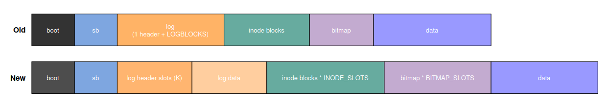

## Code Implementation

This document walks through the code changes that realize the design in [design.md](design.md), layer by layer. It follows the same structure as the design doc, plus the on-disk format and the user-space test/stat surface.

At a high level the change set is:

| Area | Files |
|------|-------|
| NVM simulator | `kernel/nvm_sim.c`, `kernel/nvm_sim.h`, `kernel/main.c`, `kernel/defs.h`, `Makefile` |
| Buffer-cache hook | `kernel/bio.c` |
| On-disk layout | `mkfs/mkfs.c`, `kernel/fs.h`, `kernel/param.h` |
| Bitmap layer | `kernel/fs.c` |
| Inode layer | `kernel/fs.c` |
| Logging layer | `kernel/log.c`, `kernel/param.h` |
| User-space syscall + tests | `kernel/sysproc.c`, `kernel/syscall.c`, `kernel/syscall.h`, `user/usys.pl`, `user/user.h`, `user/nvm_test.c`, `Makefile` |

---

### 1. NVM simulator

Files: `kernel/nvm_sim.c` (new), `kernel/nvm_sim.h` (new), `kernel/main.c`, `kernel/defs.h`, `Makefile`

There is no real NVM hardware, so the simulator is the ground truth for "how worn is this
block". Every other layer makes decisions by querying it.

#### 1.1 State

```c
// nvm_sim.h
#define NVM_BLOCKS          FSSIZE   // one entry per filesystem block
#define NVM_ENDURANCE       100000   // writes a block survives before it is "worn out"
#define NVM_READ_PENALTY    1
#define NVM_WRITE_PENALTY   10       // writes are modeled as ~10x slower than reads
#define NVM_WEAR_SKEW_LIMIT 2        // proactive-remap threshold (see below)

struct nvm_block_info {
    uint32 write_count;
    uint32 read_count;
    uint8  is_worn_out;
};
```

```c
// nvm_sim.c
static struct {
    struct spinlock lock;
    struct nvm_block_info nvm_table[NVM_BLOCKS];
} nvm;
```

#### 1.2 Access accounting

```c
void
nvm_write(uint blockno)
{
    if (blockno >= NVM_BLOCKS) return;
    nvm_delay(NVM_WRITE_PENALTY);              // simulated latency

    acquire(&nvm.lock);
    nvm.nvm_table[blockno].write_count++;
    if (nvm.nvm_table[blockno].write_count >= NVM_ENDURANCE) {
        nvm.nvm_table[blockno].is_worn_out = 1;
        printk("nvm_sim: block %d worn out!\n", blockno);
    }
    release(&nvm.lock);
}
```

`nvm_read()` is the same minus the wear check. `nvm_delay()` is a busy loop (`for (volatile int i = 0; i < units * 1000; i++);`) so that write-heavy workloads are visibly slower — it makes the benefit of spreading writes measurable, not just a counter.

#### 1.3 Query helpers (the interface the FS layers use)

```c
int  nvm_is_worn_out(uint blockno);      // hard limit reached -> never write here again
uint nvm_get_write_count(uint blockno);  // current wear of one block
uint nvm_least_worn_block(void);         // global argmin over non-worn blocks
```

`nvm_least_worn_block()` scans the whole table for the non-worn block with the lowest
`write_count`. It is used by the inode-data remap path to pick a fresh target.

#### 1.4 Wiring

- `Makefile`: add `$K/nvm_sim.o` to `OBJS`.
- `kernel/defs.h`: declare the six public functions under a `// nvm_sim.c` block.
- `kernel/main.c`: call `nvm_init()` once, right after `binit()` (buffer cache) and before `iinit()`, the table must exist before the first `bread`/`bwrite`.

```c
binit();            // buffer cache
nvm_init();         // nvm
iinit();            // inode table
```

---

### 2. Buffer-cache hook

File: `kernel/bio.c`

This is the single choke point. Every disk access in xv6 goes through `bread`/`bwrite`, so hooking these two functions means **every** block touch from any layer feeds the simulator, with no changes needed in the callers.

```c
// bread(): only count a physical read on a cache miss
b = bget(dev, blockno);
if (!b->valid) {
    nvm_read(blockno);
    virtio_disk_rw(b, 0);
    b->valid = 1;
}

// bwrite(): every write-back is a physical NVM write
void
bwrite(struct buf *b)
{
    if (!holdingsleep(&b->lock)) panic("bwrite");
    nvm_write(b->blockno);
    virtio_disk_rw(b, 1);
}
```

Note `nvm_read` is inside the `!b->valid` branch: a cache hit is not an NVM access.

---

### 3. On-disk layout changes

Files: `kernel/fs.h`, `kernel/param.h`, `mkfs/mkfs.c`

To relocate a hot metadata block we need spare physical blocks to relocate *into*. The layout change reserves a fixed number of physical "slots" per logical metadata block, and records which slot is currently live in the superblock.

#### 3.1 New disk layout



The NVM-aware layout keeps the same region order but reserves several physical blocks (slots) for each logical block that is a write hot spot, so a worn slot can be abandoned in favor of a fresh sibling without moving any region boundary:

- **Log header** - `LOG_HDR_SLOTS` physical slot for writes rotate round-robin, boot picks the slot with the highest sequence number.
- **Log data** - unchanged size (`LOGBLOCKS`), but a block is no longer pinned to a fixed offset, `write_log()` chooses the least-worn free slot per block.
- **Inode region** - each of the `ninodeblocks` logical inode blocks owns `INODE_SLOTS` contiguous physical blocks; `superblock.inodeslot[i]` names the live one.
- **Bitmap region** - each of the `nbitmap` logical bitmap blocks owns `BITMAP_SLOTS` contiguous physical blocks, `superblock.bmapslot[i]` names the live one.
- **Data region** - unchanged in structure, individual data blocks are wear-leveled by `balloc` picking the least-worn free block and by `bmap` remapping worn blocks, so they need no reserved slots.

The cost is disk space: the metadata regions are now `INODE_SLOTS`/`BITMAP_SLOTS` times larger, shrinking the data region (`nblocks = FSSIZE - nmeta`). The slot counts are chosen so metadata still fits comfortably within `FSSIZE` for the default `NINODES`.

#### 3.2 Constants (`fs.h`, `param.h`)

```c
// fs.h
#define BITMAP_SLOTS  8    // physical slots reserved per logical bitmap block
#define MAXBITMAP     8    // max logical bitmap blocks
#define INODE_SLOTS   32   // physical slots reserved per logical inode block
#define MAXINODEBLOCK 16   // max logical inode blocks

// param.h
#define LOGBLOCKS     (MAXOPBLOCKS * 3)  // log data region size
#define LOG_HDR_SLOTS 16                 // rotating log-header slots
```

#### 3.3 Superblock (`fs.h`)

```c
struct superblock {
  ...
  uint bmapstart;
  uint bmapslot[MAXBITMAP];       // active physical slot per logical bitmap block
  uint inodeslot[MAXINODEBLOCK];  // active physical slot per logical inode block
};
```

Both arrays are zero-initialized by `mkfs` (slot 0 is live at format time).

#### 3.4 Block-address macros (`fs.h`)

The old macros computed a fixed block address from an inode/block number. The new macros add a slot dimension:

```c
// inode i lives in logical block (i/IPB); its physical block depends on the active slot
#define IBLOCK_SLOT(i, sb, slot) ((i)/IPB * INODE_SLOTS + (slot) + (sb).inodestart)
#define IBLOCK(i, sb)            IBLOCK_SLOT(i, sb, (sb).inodeslot[(i)/IPB])

// bitmap bit b lives in logical block (b/BPB); physical block depends on the active slot
#define BBLOCK_SLOT(b, sb, slot) ((b)/BPB * BITMAP_SLOTS + (slot) + (sb).bmapstart)
#define BBLOCK(b, sb)            BBLOCK_SLOT(b, sb, (sb).bmapslot[(b)/BPB])
```

Both `IBLOCK` and `BBLOCK` keep their original two-argument signatures, so every existing caller (`ialloc`, `iupdate`, `ilock`, `balloc`, `bfree`, …) is transparently redirected to the currently-active slot with no call-site change. The `*_SLOT` variants take an explicit slot and are used by the relocation code to address a specific sibling slot.

#### 3.5 mkfs (`mkfs/mkfs.c`)

```c
int nlog = LOG_HDR_SLOTS + LOGBLOCKS;   // was: LOGBLOCKS + 1

// bounds checks (new)
if (nbitmap > MAXBITMAP)          die("nbitmap exceeds MAXBITMAP");
if (ninodeblocks > MAXINODEBLOCK) die("ninodeblocks exceeds MAXINODEBLOCK");

// meta size accounts for the reserved slots
nmeta = 2 + nlog + ninodeblocks * INODE_SLOTS + nbitmap * BITMAP_SLOTS;   // was: ... + ninodeblocks + nbitmap

sb.inodestart = xint(2 + nlog);
sb.bmapstart  = xint(2 + nlog + ninodeblocks * INODE_SLOTS);
```

`mkfs` still writes inodes/bitmap into slot 0 of each logical block, matching the zeroed `inodeslot[]` / `bmapslot[]`.

---

### 4. Bitmap layer

File: `kernel/fs.c`

Every `balloc`/`bfree` flips a bit in a bitmap block, making bitmap blocks write hot spots. Two changes: 
- allocation now picks the least-worn free *data* block instead of the first free one.
- the bitmap block itself gets rotating-slot relocation.

#### 4.1 Wear-aware allocation

`balloc` used to return the first free block. Now it scans the entire bitmap, skips worn-out blocks and tracks the free block with the lowest write count:

```c
for (b = 0; b < sb.size; b += BPB) {
  bp = bread(dev, BBLOCK(b, sb));
  for (bi = 0; bi < BPB && b + bi < sb.size; bi++) {
    if ((bp->data[bi/8] & (1 << (bi%8))) == 0) {   // free?
      uint blockno = b + bi;
      if (nvm_is_worn_out(blockno)) continue;
      uint wear = nvm_get_write_count(blockno);
      if (wear < best_wear) { best_block = blockno; best_wear = wear; found = 1; }
    }
  }
  brelse(bp);
}
if (!found) { printk("balloc: out of blocks\n"); return 0; }

// mark the winner
bp = bread(dev, BBLOCK(best_block, sb));
bp->data[(best_block % BPB)/8] |= 1 << (best_block % 8);
log_write(bp);
brelse(bp);
bitmap_check_wear(dev, best_block / BPB);   // maybe relocate the bitmap block
bzero(dev, best_block);
return best_block;
```

**Trade-off**: allocation is now O(nblocks) instead of O(first-free). For `FSSIZE`, that is one extra full bitmap scan per allocation.

#### 4.2 Bitmap block relocation

```c
static void
bitmap_check_wear(int dev, uint idx)
{
  uint base = sb.bmapstart + idx * BITMAP_SLOTS;
  uint cur_block = base + sb.bmapslot[idx];
  uint min_wear = /* min write_count over the BITMAP_SLOTS sibling slots */;
  uint cur_wear = nvm_get_write_count(cur_block);

  if (nvm_is_worn_out(cur_block) || cur_wear >= min_wear + NVM_WEAR_SKEW_LIMIT)
    bitmap_relocate(dev, idx);
}
```

The **skew trigger** `cur_wear >= min_wear + NVM_WEAR_SKEW_LIMIT` is proactive: it relocates *before* the block wears out, as soon as the live slot has pulled `NVM_WEAR_SKEW_LIMIT` writes ahead of its least-used sibling slot.

```c
static void
bitmap_relocate(int dev, uint idx)
{
  // pick the least-worn, non-worn sibling slot
  ... best_slot ...
  if (best_slot == cur_slot) return;

  // copy live contents into the new slot, through the log
  struct buf *old_bp = bread(dev, cur_block);
  struct buf *new_bp = bread(dev, base + best_slot);
  memmove(new_bp->data, old_bp->data, BSIZE);
  log_write(new_bp);
  brelse(old_bp); brelse(new_bp);

  sb.bmapslot[idx] = best_slot;

  // persist the superblock so the new slot survives a reboot
  struct buf *sbp = bread(dev, 1);
  memmove(sbp->data, &sb, sizeof(sb));
  log_write(sbp);
  brelse(sbp);
}
```

Both the block copy and the superblock update go through `log_write`, so the relocation is atomic with the transaction that triggered it, a crash mid-relocation either fully applies or fully rolls back, and `bmapslot[idx]` and the block contents can never disagree.

---

### 5. Inode layer

File: `kernel/fs.c`

Two independent hot spots: the **data blocks** an inode points to (via `bmap`), and the **physical block holding the dinode structs** (touched by every `iupdate`).

#### 5.1 Data-block remapping

```c
// allocate a fresh least-worn block, copy old -> new, free old
static uint
remap_block(uint dev, uint old_block)
{
  uint new_block = balloc(dev);              // balloc already returns least-worn
  if (new_block == 0) panic("remap_block: balloc failed");

  struct buf *old_buf = bread(dev, old_block);
  struct buf *new_buf = bread(dev, new_block);
  memmove(new_buf->data, old_buf->data, BSIZE);
  log_write(new_buf);
  brelse(old_buf); brelse(new_buf);

  bfree(dev, old_block);
  return new_block;
}

// worn / skew check, same predicate style as the bitmap layer
static uint
remap_if_worn(uint dev, uint addr)
{
  uint min_wear = nvm_get_write_count(nvm_least_worn_block());
  uint cur_wear = nvm_get_write_count(addr);
  if (nvm_is_worn_out(addr) || cur_wear >= min_wear + NVM_WEAR_SKEW_LIMIT)
    return remap_block(dev, addr);
  return addr;
}
```

`bmap` gains an `iswrite` parameter and applies `remap_if_worn` on every address it resolves, **but only for writes** (reads never move data). Three call sites inside `bmap`:

```c
static uint
bmap(struct inode *ip, uint bn, int iswrite)   // was bmap(ip, bn)
{
  if (bn < NDIRECT) {
    ...resolve/allocate ip->addrs[bn] into addr...
    if (iswrite) {                              // 1. direct block
      uint new_addr = remap_if_worn(ip->dev, addr);
      if (new_addr != addr) { ip->addrs[bn] = new_addr; addr = new_addr; }
    }
    return addr;
  }
  ...
  // 2. the indirect block itself (ip->addrs[NDIRECT])
  else if (iswrite) {
    uint new_addr = remap_if_worn(ip->dev, addr);
    if (new_addr != addr) { ip->addrs[NDIRECT] = new_addr; addr = new_addr; }
  }
  bp = bread(ip->dev, addr);
  a = (uint*)bp->data;
  ...resolve a[bn] into addr...
  else if (iswrite) {                           // 3. an entry inside the indirect block
    uint new_addr = remap_if_worn(ip->dev, addr);
    if (new_addr != addr) { a[bn] = new_addr; log_write(bp); addr = new_addr; }
  }
  brelse(bp);
  return addr;
}
```

Callers:

```c
readi():  uint addr = bmap(ip, off / BSIZE, 0);   // read  -> no remap
writei(): uint addr = bmap(ip, off / BSIZE, 1);   // write -> remap if worn/skewed
```

When a pointer is redirected, the new value is written back where it lives: `ip->addrs[]` in memory (flushed by the next `iupdate`), or `a[bn]` in the indirect block via `log_write(bp)`. Because `remap_block` calls `balloc` + `bfree`, the pointer rewrite and the bitmap changes land in the same transaction.

#### 5.2 Inode metadata block relocation

Mirrors the bitmap approach exactly, over `INODE_SLOTS` slots:

```c
static void inode_relocate(int dev, uint idx);    // copy logical inode block to least-worn slot,
                                                  // update sb.inodeslot[idx], persist superblock
static void inode_check_wear(int dev, uint idx);  // worn || skew -> inode_relocate
```

`inode_check_wear(ip->dev, ip->inum / IPB)` is called at the end of both `iupdate()` and `ialloc()`, the two functions that write an inode block. `IBLOCK` (redefined in `fs.h`) already routes every read of that logical block through `inodeslot[]`, so nothing else changes.

#### 5.3 Superblock accessor

```c
// fs.c
struct superblock* fsgetsb(void) { return &sb; }
```

Declared in `defs.h`. Used by `sys_nvmstats` (section 7) to read region boundaries.

---

### 6. Logging layer

Files: `kernel/log.c`, `kernel/param.h`

Two hot spots in the log: the **log header** and the **log data blocks**.

#### 6.1 Header and in-memory structs

```c
struct logheader {
  int  n;
  uint seq;                // monotonically increasing; boot picks the highest
  int  block[LOGBLOCKS];
  int  slot[LOGBLOCKS];    // which physical log-data slot each block was written to
};

struct log {
  struct spinlock lock;
  int  hstart;   // was `start`: base of the K header slots
  int  dstart;   // base of the log-data area (= hstart + LOG_HDR_SLOTS)
  int  hcur;     // index of the header slot currently live
  uint seq;      // seq of the last header written
  ...
};
```

```c
// initlog()
log.hstart = sb->logstart;
log.dstart = sb->logstart + LOG_HDR_SLOTS;
```

#### 6.2 Header: round-robin over K slots

The design note explains why round-robin (not wear tracking) is enough here, every commit writes the header exactly twice, at fixed size, so wear spreads evenly on its own.

```c
// write_head(): advance to the next slot, bump seq
log.hcur = (log.hcur + 1) % LOG_HDR_SLOTS;
log.seq++;
struct buf *buf = bread(log.dev, log.hstart + log.hcur);
struct logheader *hb = (struct logheader*)buf->data;
hb->n = log.lh.n;
hb->seq = log.seq;
for (i = 0; i < log.lh.n; i++) { hb->block[i] = log.lh.block[i]; hb->slot[i] = log.lh.slot[i]; }
bwrite(buf);
brelse(buf);
```

```c
// read_head(): scan all slots, load the one with the highest seq
for (int slot = 0; slot < LOG_HDR_SLOTS; slot++) {
  bufs[slot] = bread(log.dev, log.hstart + slot);
  struct logheader *hb = (struct logheader*)bufs[slot]->data;
  if (slot == 0 || hb->seq >= best_seq) { best_seq = hb->seq; best_slot = slot; }
}
// adopt best_slot: set log.hcur, log.seq, and copy n/block[]/slot[] into log.lh
```

On a fresh filesystem all headers have `seq == 0`; `slot == 0 || hb->seq >= best_seq` makes the scan deterministically pick slot 0.

#### 6.3 Log data: wear-aware slot selection

Transaction sizes vary, so a fixed rotation still skews wear toward low-numbered slots. Instead, `write_log()` picks, for each logged block, the least-worn slot not already used *in this transaction*:

```c
static void
write_log(void)
{
  int used[LOGBLOCKS] = {0};
  for (int tail = 0; tail < log.lh.n; tail++) {
    int best = -1; uint best_wear = 0xFFFFFFFF;
    for (int s = 0; s < LOGBLOCKS; s++) {
      if (used[s]) continue;
      uint w = nvm_get_write_count(log.dstart + s);
      if (w < best_wear) { best_wear = w; best = s; }
    }
    used[best] = 1;
    log.lh.slot[tail] = best;                       // remembered in the header

    struct buf *to   = bread(log.dev, log.dstart + best);
    struct buf *from = bread(log.dev, log.lh.block[tail]);
    memmove(to->data, from->data, BSIZE);
    bwrite(to);
    brelse(from); brelse(to);
  }
}
```

#### 6.4 Recovery

`install_trans()` must now read each block from the slot recorded in the header rather than a computed offset:

```c
// was:  bread(log.dev, log.start + tail + 1)
struct buf *lbuf = bread(log.dev, log.dstart + log.lh.slot[tail]);
```

Because `slot[]` is part of the on-disk header, recovery after a crash uses the exact same slot assignment that the commit used.

#### 6.5 param.h

```c
#define LOGBLOCKS     (MAXOPBLOCKS * 3)
#define LOG_HDR_SLOTS 16
```

`LOGBLOCKS` moved here (was in `fs.h` as a bare count) so both `log.c` and `mkfs` see the same value alongside `LOG_HDR_SLOTS`.

---

### 7. User-space: syscall and tests

Files: `kernel/sysproc.c`, `kernel/syscall.c`, `kernel/syscall.h`, `user/usys.pl`, `user/user.h`, `user/nvm_test.c`, `Makefile`

#### 7.1 `nvmstats` syscall

Standard xv6 syscall wiring:

- `syscall.h`: `#define SYS_nvmstats 23`
- `syscall.c`: `extern uint64 sys_nvmstats(void);` and `[SYS_nvmstats] sys_nvmstats,` in the table
- `usys.pl`: `entry("nvmstats");`
- `user/user.h`: `int nvmstats(void);`

```c
// sysproc.c
uint64
sys_nvmstats(void)
{
  nvm_print_block_used();

  struct superblock *sbp = fsgetsb();
  uint nbitmap = sbp->size / BPB + 1;

  nvm_print_stats("log",    sbp->logstart,   sbp->inodestart);
  nvm_print_stats("inode",  sbp->inodestart, sbp->bmapstart);
  nvm_print_stats("bitmap", sbp->bmapstart,  sbp->bmapstart + nbitmap * BITMAP_SLOTS);
  nvm_print_stats("data",   sbp->bmapstart + nbitmap * BITMAP_SLOTS, sbp->size);
  return 0;
}
```

It prints per-region wear so you can see, e.g., that the `bitmap` region's spread stays under `NVM_WEAR_SKEW_LIMIT` while total writes climb.

#### 7.2 `user/nvm_test.c`

Added to `UPROGS` in the `Makefile` as `_nvm_test`. Three tests, each ending with a full read-back verification:

| Test | What it exercises |
|------|-------------------|
| `direct_block_test` | 200 rounds of create/write/read on a small file → repeated writes to the same direct data block → `remap_if_worn` in the direct path, plus bitmap churn from `balloc`/`bfree` each round |
| `indirect_block_test` | one file grown to `NDIRECT + 8` blocks, read back block-by-block → correctness of the indirect path |
| `indirect_wear_stress_test` | fill to `NDIRECT`, then append 200 blocks one at a time → each append re-writes the *same* indirect block → `remap_if_worn` on the indirect block itself |
