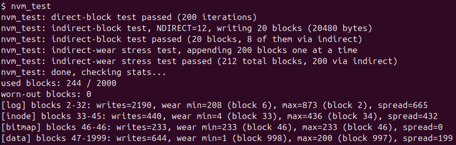
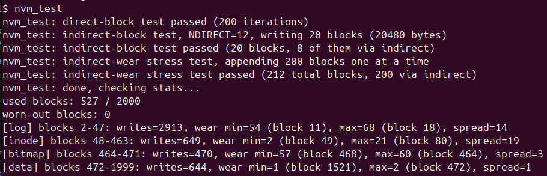

### Testing
```
make clean
make qemu
nvm_test
```

### Results
Both runs execute the exact same workload (`nvm_test`: 200 direct-block rewrites, a 20-block indirect file, and a 200-block indirect-append stress loop).

- #### Before
    

    Without wear-leveling, writes were hot-spotted: a few blocks absorbed almost all the writes while most blocks were barely touched. Every metadata region shows a large wear spread - log 665, inode 432, data 199 (the bitmap has only 1 physical block, so its spread is 0, but that single block is itself the hot-spot with 233 writes).

- #### After
    
    After adding wear-leveling, writes are distributed across the reserved slots and the wear spread drops sharply in every region.

### Trade-offs

**Endurance vs. Capacity** : Reserving a slot pool per logical metadata block grows the metadata footprint substantially (used blocks 244 -> 527 in the test), traded for a significant drop in peak per-block wear.

**Allocation cost for endurance** : Allocation now costs O(nblocks) instead of O(first-free), since each allocation requires one extra full bitmap scan to find the least-worn candidate.
